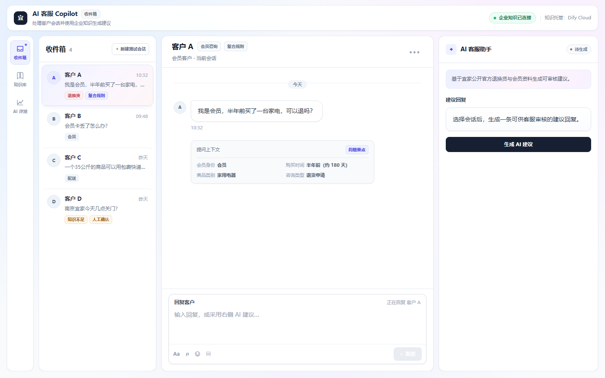
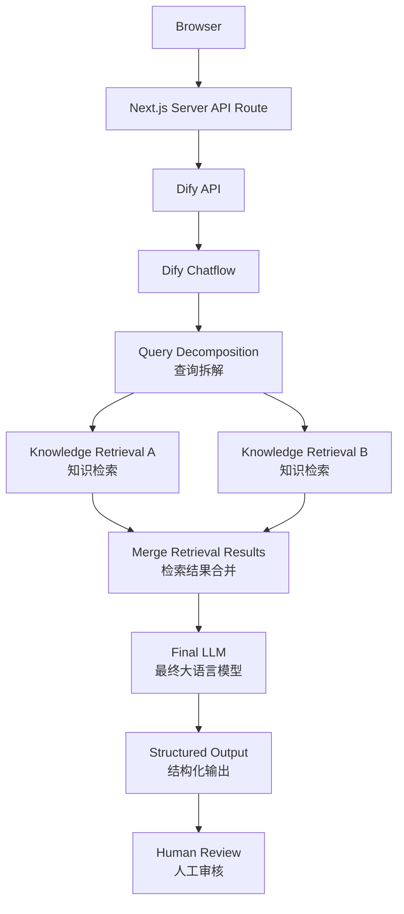

# AI 客服 Copilot

> 面向企业一线客服的 AI Copilot（智能辅助），基于企业知识生成可审核的建议回复，并由人工坐席保留最终决策权。

[在线体验 Public Demo](https://ai-customer-service-copilot-eight.vercel.app/)



---

## 1. 项目概览

这是一个用于 AI 产品实习作品集展示的 **Functional Prototype（可运行原型）**，而非生产级企业系统。

它将企业客服的“查知识—判断规则—组织回复—处理例外”流程，包装为一个 Human-in-the-loop（人工审核）工作台：AI 提供有知识依据的建议，客服可以采纳、编辑、重新生成或人工确认。

- **目标用户：** 企业一线客服人员
- **核心价值：** 减少查找分散政策与 FAQ 的认知负担，帮助坐席更快形成可审核回复
- **产品原则：** Copilot, not Autopilot（辅助决策，而非自动替代人工）

当前产品包含四个入口：

| 路由 | 页面 | 当前用途 |
| --- | --- | --- |
| `/` | Landing Page（产品介绍页） | 向首次访问者说明产品定位、核心能力、人机协作流程与体验入口 |
| `/inbox` | Inbox（客服工作台） | 处理会话、生成和审核 AI 建议回复 |
| `/knowledge` | Knowledge（知识库） | 查看当前接入的知识资料、覆盖范围与知识边界 |
| `/evaluation` | AI Evaluation（AI 评测） | 查看代表性案例的预期状态、实际状态与验证结果 |

Landing Page 使用当前真实 Inbox、Knowledge 和 Evaluation 页面截图，仅作为产品介绍与体验入口，不构成新的业务功能。

### 当前产品页面

**Inbox / 客服工作台**

- 提供四个预设客服会话，并支持新建临时测试会话；
- 展示客户消息、AI 建议回复和真实 Knowledge Sources（知识来源）；
- 支持 `supported`、`clarify`、`insufficient` 三态；
- 支持采用、编辑、重新生成、人工确认和 Reply Composer（回复编辑器）；
- Demo Mode 与 Real Mode 共用同一产品界面，工作区保持独立内部滚动。

**Knowledge / 知识库**

- 展示当前项目接入的三份知识资料；
- 支持资料列表与详情切换、知识覆盖范围、内容预览和知识边界说明；
- Dify Cloud 作为知识托管层，仅以低权重信息展示。

该页面是产品展示层，不是 Next.js 自建的 Vector Database（向量数据库）管理后台，不支持上传、删除、编辑、重新索引或检索参数配置。

**AI Evaluation / AI 评测**

- 展示三个代表性测试案例；
- 对照 Expected Status（预期状态）、Actual Status（实际状态）和 Validation Result（验证结果）；
- 展示问题要点、AI 建议回复、知识依据和逐项验证检查。

---

## 2. 问题与产品定位

企业客服常需在政策、FAQ 和商品规则间查找信息。简单问题会增加重复检索成本；同时涉及会员身份、购买时间、商品类别等条件的复合问题，容易遗漏某一条适用规则。

直接让通用 LLM（Large Language Model，大语言模型）自由回答企业问题存在两类风险：

1. 未基于企业知识回答，可能偏离实际政策；
2. 知识不足时仍给出确定性结论，增加客服判断风险。

因此，本项目不将 AI 设计成面向消费者的聊天机器人，而是设计为客服坐席的决策辅助工具：只有在企业知识边界内给出建议；知识不足或需要补充关键信息时，明确交还给人工处理。

---

## 3. 核心工作流

```text
客户问题
→ AI 检索企业知识
→ 生成建议回复与知识依据
→ 客服采纳 / 编辑
→ 必要时交由人工确认
```

工作台包含客户会话、当前客户问题、AI Copilot 建议回复和知识依据。AI 输出不是自动发送的最终答复：坐席需要审核后采纳，或直接编辑为最终客服回复；在知识不足场景下，界面提示人工确认。

Inbox 还支持“新建测试会话”：用户可以输入一个临时客户问题并将其加入会话列表。Real Mode 下，该问题继续调用现有 Dify / RAG 链路，并可使用三态结果、知识来源、采用、编辑、重新生成和人工确认等能力。临时会话仅保存在 React 内存中，刷新页面后清除；当前没有数据库、Local Storage（本地存储）或 CRM 持久化。

---

## 4. AI / RAG 架构

RAG（Retrieval-Augmented Generation，检索增强生成）流程由既有 Dify Chatflow 执行，Web 前端不重新实现检索或推理链路。



对于复杂查询，Query Decomposition（查询拆解）将不同业务条件转为独立检索 Query；双路 Knowledge Retrieval（知识检索）分别查找相关规则，再合并上下文交给 Final LLM（最终大语言模型）生成建议。Next.js 仅负责客服工作台和服务端 API 调用：

```text
Browser
→ Next.js Server API Route
→ Dify API
→ Dify Chatflow
→ Query Decomposition
→ Multi-Retrieval
→ Merge Context
→ Final LLM
→ Structured Output
→ Human Review
```

---

## 5. 回答状态、决策边界与知识引用

### 结构化决策状态

Dify 返回结构化输出，前端依据 `answer_status` 处理业务状态，而不再通过回答文本或正则表达式猜测状态：

```json
{
  "answer_status": "supported | clarify | insufficient",
  "answer": "最终展示给客服的自然语言建议",
  "missing_info": ["可能影响判断的必要补充信息"]
}
```

- **supported：** 知识依据支持当前建议，展示可审核回复。
- **clarify：** 缺失的信息可能改变最终结论，展示澄清问题。
- **insufficient：** 当前知识不足以支持回答，提示“知识依据不足，建议人工确认”。

前端分别将三态表达为“知识支持”“需要补充信息”和“知识不足”。`missing_info` 仅用于承载仍可能改变最终结论的必要补充信息。

### 真实知识引用

Real Mode 仅展示 Dify API 实际返回的知识引用，不伪造来源。进入前端前，引用会优先按知识切片 ID 去重；缺少切片 ID 时按内容去重；随后按相关性 score（相关性分数）降序排序。界面最多展示前三条，完整来源数据不因展示数量而截断。

如果 Dify 没有返回可展示来源，界面显示“暂无可展示知识来源”。当状态为 `insufficient`、但检索过程返回了相关资料时，来源区域使用“检索到的资料”，并明确这些资料不足以支持确定性回答，不将其误称为最终回答的知识依据。

---

## 6. 评测、回归测试与迭代

本项目使用代表性问题进行固定回归和重复稳定性测试。这些结果用于验证当前原型在锁定模型、Prompt（提示词）和检索配置下的功能行为，**不代表生产环境准确率、泛化能力、真实客服效率或业务效果。**

Prompt V2.2 和当前模型配置锁定后，本轮验证分为两部分：

- 第一轮固定代表性测试包含 12 个不同问题，12 次运行的 `answer_status` 和核心业务结论均符合预期；
- 随后针对最容易发生状态漂移的 4 个问题，每题重复运行 3 次，共 12 次，状态类型和核心业务判断保持一致。

因此，在本轮固定代表性回归测试中，24 次运行的状态判断与核心业务结论均符合预期。这是原型测试观察，不是生产 Benchmark（基准测试）或准确率声明。

Evaluation 页面当前展示三个核心案例，三个案例均通过本轮验证：

| 代表性案例 | Expected | Actual | Result | 核心观察 |
| --- | --- | --- | --- | --- |
| 会员卡丢了怎么办？ | 知识支持 | 知识支持 | 通过 | 能检索会员卡补领规则并形成明确建议 |
| 我是会员，半年前买了一台家用电器，可以退吗？ | 知识支持 | 知识支持 | 通过 | 家用电器排除规则优先于会员 365 天期限，不能仅依据期限判断可普通退货 |
| 南京宜家今天几点关门？ | 知识不足 | 知识不足 | 通过 | 当前知识库不包含实时营业信息，系统没有编造营业时间 |

### 知识库 / RAG 迭代：V1 → V2 → V2.1

- **V1：** 原始 PDF 直接入库，Chunk（知识切片）较大；上下文较完整，但检索噪声较高。
- **V2：** 清洗为 Markdown，并按 FAQ / 语义单元拆分知识；引入 Query Decomposition（查询拆解）、双路 Knowledge Retrieval（知识检索）与结果合并，以提升复合规则问题的覆盖。
- **V2.1：** 在 V2 基础上重点解决可控性与稳定性问题：增加 supported / clarify / insufficient 三态结构化输出，接入真实知识引用，并通过固定回归与重复测试定位查询漂移、错误澄清、结构化输出截断与长尾延迟问题。

在当前测试案例中，V2.1 改善了多规则场景下的规则覆盖；这一观察不等同于系统性准确率提升。

### 失败分析与 AI 质量修复

回归测试中，复杂规则问题出现过两类不稳定行为：

1. **复杂规则漏召回：** Query Decomposition 曾将商品特殊规则、会员身份和时间条件混合在同一个检索查询中，导致关键排除规则召回不稳定。通过对比拆解 Query、Retrieval 结果与知识库直接检索结果，定位到查询改写问题，并调整查询拆解策略。
2. **状态边界漂移：** Final LLM 对 `supported` 与 `clarify` 的 Decision Boundary（决策边界）存在灰区。例如“会员买的东西，过了半年还能退吗？”有时会过早进入 `supported`，但商品类别、商品状态或凭证等缺失信息仍可能改变最终结论。

本轮修复将 Query Decomposition 和 Final LLM 调整为 `qwen3.7-max`，并使用 Final Prompt V2.2 收紧状态边界：

- 决定性排除条件已知 → `supported`；
- 缺少可能改变最终结论的信息 → `clarify`；
- 知识库本身缺少相关规则 → `insufficient`。

在当前原型测试集和配置下，新的模型与 Prompt 组合表现出更一致的状态判断；这不表示某个模型天然更稳定，也不构成生产准确率结论。

### 其他代表性测试题

- “会员买的东西，过了半年还能退吗？” → `clarify`：仅确认时间条件不足以判断最终资格；
- “我三个月前买的东西还能退吗？” → `clarify`：需要确认会员身份等可能改变结论的信息。

---

## 7. 模型与延迟权衡

模型、Thinking（显式思考）与推理配置都会影响回答稳定性和响应延迟。当前锁定的原型验证配置为：

| 配置项 | 当前验证配置 |
| --- | --- |
| Query Decomposition | `qwen3.7-max` |
| Final LLM | `qwen3.7-max` |
| Final Prompt | V2.2 |
| Final LLM Temperature | `0.1` |
| Seed | `1234` |
| Retrieval Top K | `3` |
| Rerank | `qwen3-rerank` 当前配置 |
| Web Search | 关闭 |
| Thinking | 关闭 |

这些配置服务于当前原型和代表性测试集，不声称是永久或生产环境下的最优配置。

这不是“更快一定更好”的结论，而是针对当前 PoC 的取舍：

- 查询拆解和多路检索有助于覆盖复合规则，但会增加调用链路、延迟与模型成本；
- 足够的 Max Tokens（最大输出长度）可以降低模型在最终结构化结果生成前被截断的风险；
- 显式 Thinking（思考模式）可能提高复杂判断的推理预算，但也会增加响应延迟和长尾等待；
- 当前关闭显式 Thinking，以控制原型响应延迟；本轮未将 Thinking On/Off 作为独立 A/B 变量进行系统评估。

---

## 8. Demo Mode（演示模式）与 Real Mode（真实模式）

### Public Demo（公开演示）

公开 Production 环境使用 Demo Mode：

- 使用预设 Mock 数据；
- 不调用真实 Dify API；
- 页面明确标记“演示数据”；
- 用于稳定、安全的作品集公开展示，不将 Mock 结果冒充真实 AI 输出。

Demo Mode 可以创建临时测试会话，但不会为任意自定义问题伪造答案。生成时会提示：“公开演示模式仅支持预设案例。自定义问题需要在 Real Mode 下使用。”

### Real Mode（真实模式）

Real Mode 通过服务端调用真实 Dify Chatflow，用于受控演示：

```text
Browser → Next.js Server API Route → Dify Chatflow
```

它支持真实结构化状态和实际返回的知识引用；不公开真实 API 访问入口或密钥。

Real Mode 支持自定义测试问题。请求由浏览器发送到 Next.js `/api/ai`，再由服务端访问 Dify；API Key 不会进入浏览器端代码。

---

## 9. 安全与密钥边界

- `DIFY_API_KEY` 仅由服务端读取；浏览器不直接访问 Dify。
- `.env.local` 被 Git 忽略，不提交真实密钥。
- Real Mode 的请求链路为 Browser → Next.js Server API Route → Dify。
- Public Production 不配置真实 Dify Secret；Real Mode 与 Public Demo 使用独立的 Vercel Environment Variables（环境变量）。
- RAG、查询拆解、检索与最终生成属于 Dify Chatflow 的职责；Web 应用不声称自行实现完整 RAG 系统。

---

## 10. 本人负责内容与已知限制

### 本人负责内容

我主导了以下产品与验证工作：

- 产品问题定义与 Copilot 工作流设计；
- FAQ / 知识结构设计；
- 查询拆解与检索策略设计；
- Evaluation（评估）测试设计与 Failure Analysis；
- 模型与延迟 Trade-off（权衡）；
- 产品状态与人工审核流程设计。

工程实现过程中使用 Codex 等 AI Coding（AI 编程）工具辅助；本人负责需求拆解、方案设计、实现验收、测试验证与关键产品/技术取舍。

### 已知限制

- **知识范围有限：** 当前主要覆盖宜家退货政策、会员 FAQ 和配送资料，不包含实时营业时间、实时库存、订单状态、CRM 数据或用户账户数据；
- **自定义会话不持久化：** 临时测试会话仅存在于 React 内存，刷新后清除；
- **Knowledge 页面是展示层：** 不支持实时上传、删除、同步、索引管理或 Dify 检索参数配置；
- **Evaluation 是代表性测试：** 当前结果不是生产 Benchmark、生产准确率或真实业务效果证明；
- **模型与配置敏感：** LLM 与 Retrieval 仍具有非确定性；固定 Prompt、模型和测试集可以提高当前观察的一致性，但不能保证所有未知问题表现相同；
- **引用需要结合状态理解：** `insufficient` 状态下检索到的相关资料不一定构成最终回答依据；
- **系统集成有限：** 尚无真实企业客服用户与生产流量验证，未接入 CRM、工单、订单系统，也不包含生产级身份认证、多租户、审计和监控体系；
- **产品边界：** 当前项目是 Human-in-the-loop Copilot，不是 Autonomous Customer Service Agent（自主客服智能体）；AI 生成建议，最终回复仍由人工采用、编辑或确认。

---

## 11. 技术栈与本地运行

### 技术栈

- **Frontend：** Next.js 16、React 19、TypeScript、Tailwind CSS 4
- **AI Workflow：** Dify Chatflow
- **AI Approach：** RAG、Query Decomposition、Multi-Retrieval、Structured Output
- **API：** Next.js Server API Route、REST API
- **Deployment：** Vercel

### 本地运行

安装依赖：

```bash
npm install
```

在根目录创建 `.env.local`：

```dotenv
DIFY_API_URL=
DIFY_API_KEY=
NEXT_PUBLIC_DEMO_MODE=
```

Demo Mode：

```dotenv
NEXT_PUBLIC_DEMO_MODE=true
```

Real Mode：

```dotenv
NEXT_PUBLIC_DEMO_MODE=false
```

Real Mode 还需要配置服务端 Dify 参数。启动项目：

```bash
npm run dev
```

打开 [http://localhost:3000](http://localhost:3000)。

本地页面入口：

- Landing Page：`http://localhost:3000/`
- Inbox：`http://localhost:3000/inbox`
- Knowledge：`http://localhost:3000/knowledge`
- AI Evaluation：`http://localhost:3000/evaluation`

---

## 12. 项目说明与免责声明

本项目是个人 AI 产品作品集原型，基于公开的宜家退换货、会员和配送资料构建，不代表宜家官方产品、合作项目或真实企业部署。
