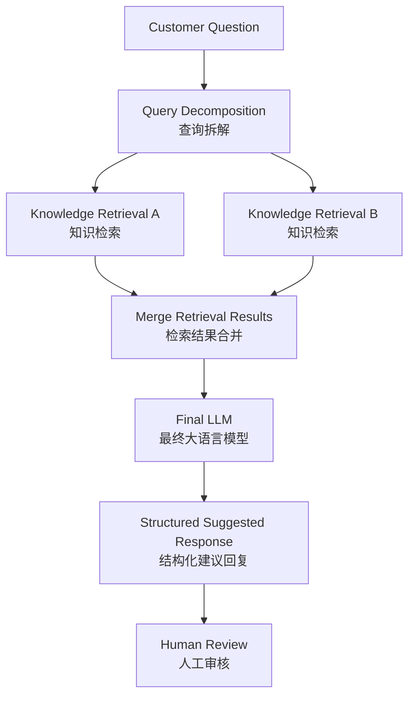

# AI Customer Service Copilot

> 面向企业一线客服的 AI Copilot（智能辅助），基于企业知识生成可审核的建议回复，并由人工坐席保留最终决策权。

[在线体验 Public Demo](https://ai-customer-service-copilot-eight.vercel.app/)


---

## 1. Project Overview

这是一个用于 AI 产品实习作品集展示的 **Functional Prototype（可运行原型）**，而非生产级企业系统。

它将企业客服的“查知识—判断规则—组织回复—处理例外”流程，包装为一个 Human-in-the-loop（人工审核）工作台：AI 提供有知识依据的建议，客服可以采纳、编辑或转人工。

- **目标用户：** 企业一线客服人员
- **核心价值：** 减少查找分散政策与 FAQ 的认知负担，帮助坐席更快形成可审核回复
- **产品原则：** Copilot, not Autopilot（辅助决策，而非自动替代人工）

---

## 2. Problem & Product Positioning

企业客服常需在政策、FAQ 和商品规则间查找信息。简单问题会增加重复检索成本；同时涉及会员身份、购买时间、商品类别等条件的复合问题，容易遗漏某一条适用规则。

直接让通用 LLM（Large Language Model，大语言模型）自由回答企业问题存在两类风险：

1. 未基于企业知识回答，可能偏离实际政策；
2. 知识不足时仍给出确定性结论，增加客服判断风险。

因此，本项目不将 AI 设计成面向消费者的聊天机器人，而是设计为客服坐席的决策辅助工具：只有在企业知识边界内给出建议；知识不足或需要补充关键信息时，明确交还给人工处理。

---

## 3. Product Workflow

```text
客户问题
→ AI 检索企业知识
→ 生成建议回复与知识依据
→ 客服采纳 / 编辑
→ 必要时转人工确认
```

工作台包含客户会话、当前客户问题、AI Copilot 建议回复和知识依据。AI 输出不是自动发送的最终答复：坐席需要审核后采纳，或直接编辑为最终客服回复；在知识不足场景下，界面突出“转人工”。

---

## 4. AI / RAG Architecture

RAG（Retrieval-Augmented Generation，检索增强生成）流程由既有 Dify Chatflow 执行，Web 前端不重新实现检索或推理链路。



对于复杂查询，Query Decomposition（查询拆解）将不同业务条件转为独立检索 Query；双路 Knowledge Retrieval（知识检索）分别查找相关规则，再合并上下文交给 Final LLM（最终大语言模型）生成建议。Next.js 仅负责客服工作台和服务端 API 调用：

```text
Browser → Next.js Server API Route → Dify Chatflow → RAG / LLM
```

---

## 5. Structured Decisions & Knowledge Citations

### 结构化决策状态

Dify 返回结构化输出，前端依据 `answer_status` 处理业务状态，而不再通过回答文本或正则表达式猜测状态：

```json
{
  "answer_status": "supported | clarify | insufficient",
  "answer": "最终展示给客服的自然语言建议",
  "missing_info": ["可能影响判断的必要补充信息"]
}
```

- **supported：** 知识依据支持当前建议，展示可审核回复。
- **clarify：** 缺失的信息可能改变最终结论，展示澄清问题。
- **insufficient：** 当前知识不足以支持回答，提示“知识依据不足，建议人工确认”。

### 真实知识引用

Real Mode 仅展示 Dify API 实际返回的知识引用，不伪造来源。进入前端前，引用会优先按知识切片 ID 去重；缺少切片 ID 时按内容去重；随后按相关性 score（相关性分数）降序排序。界面最多展示前三条，完整来源数据不因展示数量而截断。

---

## 6. Evaluation, Failure Analysis & Iteration

本项目使用代表性问题进行固定回归、重复稳定性测试、盲测和线上 Preview Smoke Test（预览环境冒烟测试）。这些结果用于验证当前原型的功能行为，**不代表生产环境准确率、真实客服效率或业务效果。**

| 验证项 | 当前记录 | 用途 |
| --- | --- | --- |
| Final LLM 配置验证 | 6/6 | 检查最终生成配置在固定案例上的行为 |
| 新 Blind Test（盲测） | 6/6 | 检查未纳入原始回归的代表性问题 |
| Preview Smoke Test | 3/3 | 检查线上预览环境核心链路可用性 |

### V1 → V2 → V2.1

- **V1：** 原始 PDF 直接入库，Chunk（知识切片）较大；上下文较完整，但检索噪声较高。
- **V2：** 清洗为 Markdown，并按 FAQ / 语义单元拆分知识；引入 Query Decomposition（查询拆解）、双路 Knowledge Retrieval（知识检索）与结果合并，以提升复合规则问题的覆盖。
- **V2.1：** 在 V2 基础上重点解决可控性与稳定性问题：增加 supported / clarify / insufficient 三态结构化输出，接入真实知识引用，并通过固定回归、重复测试和盲测定位查询漂移、错误澄清、结构化输出截断与长尾延迟问题。

在当前测试案例中，V2.1 改善了多规则场景下的规则覆盖；这一观察不等同于系统性准确率提升。

### 代表性 Failure Analysis（失败分析）

1. **复杂规则漏召回：** 查询拆解曾偏向时间或身份条件，漏召回商品排除规则。通过对比拆解 Query、Retrieval 结果与知识库直接检索结果，定位为查询改写优先级问题，并优化拆解优先级。
2. **错误澄清：** 当已有决定性否决条件时，模型曾继续询问其他条件。后续将 `clarify` 收敛为：仅当缺失信息可能改变最终结论时才进入澄清。
3. **Structured Output（结构化输出）失败：** 曾观察到 `completion_tokens=511`、`finish_reason=length`。定位为测试期间 Max Tokens=512，使 DeepSeek 推理输出被截断、最终 JSON 未生成；恢复输出上限后重新验证。

---

## 7. Model & Latency Trade-offs

查询拆解与 Final LLM 分别测试过模型、Thinking（显式思考）与推理配置。最终版本在当前代表性回归与盲测中未观察到正确性回退的前提下，关闭显式 Thinking，以降低响应延迟与长尾等待。

这不是“更快一定更好”的结论，而是针对当前 PoC 的取舍：

- 查询拆解和多路检索有助于覆盖复合规则，但会增加调用链路、延迟与模型成本；
- 足够的 Max Tokens（最大输出长度）可以降低模型在最终结构化结果生成前被截断的风险；
- 显式 Thinking（思考模式）可能提高复杂判断的推理预算，但也会增加响应延迟和长尾等待；
- 最终配置在代表性测试未观察到明显正确性回退的前提下，选择关闭显式 Thinking，以改善响应时间。

---

## 8. Demo Mode / Real Mode

### Public Demo

公开 Production 环境使用 Demo Mode：

- 使用预设 Mock 数据；
- 不调用真实 Dify API；
- 页面明确标记“演示数据”；
- 用于稳定、安全的作品集公开展示，不将 Mock 结果冒充真实 AI 输出。

### Real Mode

Real Mode 通过服务端调用真实 Dify Chatflow，用于受控演示：

```text
Browser → Next.js Server API Route → Dify Chatflow
```

它支持真实结构化状态和实际返回的知识引用；不公开真实 API 访问入口或密钥。

---

## 9. Security & System Boundaries

- `DIFY_API_KEY` 仅由服务端读取；浏览器不直接访问 Dify。
- `.env.local` 被 Git 忽略，不提交真实密钥。
- Real Mode 的请求链路为 Browser → Next.js Server API Route → Dify。
- Public Production 不配置真实 Dify Secret；Real Mode 与 Public Demo 使用独立的 Vercel Environment Variables（环境变量）。
- RAG、查询拆解、检索与最终生成属于 Dify Chatflow 的职责；Web 应用不声称自行实现完整 RAG 系统。

---

## 10. What I Owned & Known Limitations

### What I Owned

我主导了以下产品与验证工作：

- 产品问题定义与 Copilot 工作流设计；
- FAQ / 知识结构设计；
- 查询拆解与检索策略设计；
- Evaluation（评估）测试设计与 Failure Analysis；
- 模型与延迟 Trade-off（权衡）；
- 产品状态与人工审核流程设计。

工程实现过程中使用 Codex 等 AI Coding（AI 编程）工具辅助；本人负责需求拆解、方案设计、实现验收、测试验证与关键产品/技术取舍。

### Known Limitations

- 尚无真实企业客服用户与生产流量验证；
- 未接入真实 CRM、工单或订单系统；
- 不包含生产级身份认证、多租户、审计和监控体系；
- LLM 与 Retrieval 仍具有一定非确定性；
- `insufficient` 状态下检索到的相关资料不一定构成回答依据；
- 当前测试结果不等同于生产准确率或真实业务效果。

---

## 11. Tech Stack & Local Setup

### Tech Stack

- **Frontend：** Next.js、React、TypeScript
- **AI Workflow：** Dify Chatflow
- **AI Approach：** RAG、Query Decomposition、Knowledge Retrieval
- **API：** Next.js Server API Route、REST API
- **Deployment：** Vercel

### Local Setup

安装依赖：

```bash
npm install
```

在根目录创建 `.env.local`：

```dotenv
DIFY_API_URL=
DIFY_API_KEY=
NEXT_PUBLIC_DEMO_MODE=
```

Demo Mode：

```dotenv
NEXT_PUBLIC_DEMO_MODE=true
```

Real Mode：

```dotenv
NEXT_PUBLIC_DEMO_MODE=false
```

Real Mode 还需要配置服务端 Dify 参数。启动项目：

```bash
npm run dev
```

打开 [http://localhost:3000](http://localhost:3000)。
