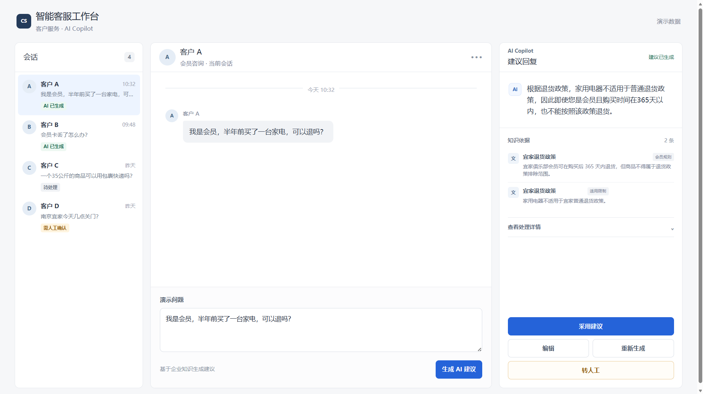
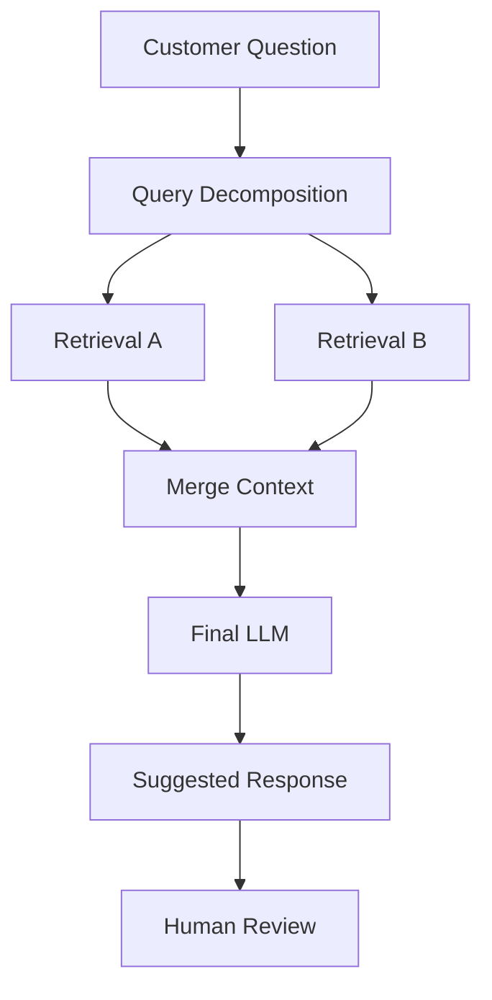

# AI Customer Service Copilot

> 基于企业知识库的 RAG 客服建议与人工确认工作台

这是一个面向企业一线客服人员的 AI Copilot。系统通过 RAG 检索企业知识库，为客服生成可审核的建议回复；对于知识依据不足的问题，不给出未经验证的确定性答案，并引导人工确认。

[在线体验 Public Demo](https://ai-customer-service-copilot-eight.vercel.app/)

- Public Demo 使用 Mock 数据，不调用真实 Dify API。
- Real Mode 接入真实 Dify Chatflow，仅用于受控演示。



---

## Overview

企业客服在处理用户咨询时，经常需要查询分散的政策、FAQ 和业务规则。对于简单问题，人工查找资料增加操作成本；对于同时涉及会员身份、购买时间、商品类别等多个条件的问题，还可能遗漏适用规则。

直接让通用 LLM 自由回答企业业务问题，在知识依据不足时可能产生脱离企业政策的错误答案。因此，本项目采用 Human-in-the-loop AI Copilot：

```text
客户问题 → 企业知识检索 → AI 建议回复 → 客服审核 → 采用 / 编辑 / 重新生成 / 人工确认
```

AI 负责辅助检索和组织回复，客服始终保留最终决策权。

---

## Problem

### 1. 企业知识检索成本

使用案例：**“会员卡丢了怎么办？”**

客服不应每次重新翻找 FAQ，而应快速获得基于企业知识的建议回复。

### 2. 复杂问题涉及多个业务条件

使用案例：**“我是会员，半年前买了一台家电，可以退吗？”**

该问题同时涉及：

- 会员身份
- 购买时间
- 商品类别
- 退货政策

单条 Retrieval 可能不足以完成判断。

### 3. AI 不应该回答所有问题

使用案例：**“南京宜家今天几点关门？”**

如果知识库没有足够依据，模型不应该利用通用知识猜测确定性业务答案。系统应当：知识不足 → 不给确定性答案 → 标记需要人工确认。

---

## Solution

本项目采用 **RAG + Query Decomposition + Multi-Retrieval + Human-in-the-loop**：

```text
Customer Question
→ Query Decomposition
→ Retrieval A / Retrieval B
→ Merge Context
→ Final LLM
→ Suggested Response
→ Human Review
```

对于简单问题，系统检索相关企业知识并生成建议回复。对于包含多个业务条件的问题，Dify Chatflow 通过 Query Decomposition 将问题拆分为多个检索 Query，分别执行 Retrieval，再合并 Context，由最终 LLM 根据多条规则生成建议回复。

对于知识依据不足的问题，系统避免给出确定性业务答案，并提示人工确认。

---

## Key Scenarios

| 场景 | 示例问题 | 验证目标 |
| --- | --- | --- |
| 简单 FAQ | 会员卡丢了怎么办？ | 验证单规则知识检索与建议回复 |
| 复合规则问题 | 我是会员，半年前买了一台家电，可以退吗？ | 验证多路检索、规则合并与条件判断 |
| 知识不足 | 南京宜家今天几点关门？ | 验证知识不足识别与人工确认 |

本项目不虚构准确率、成本节省或效率提升等未经真实业务验证的指标。

---

## AI / RAG Architecture



- **Query Decomposition**：将包含多个业务条件的问题拆分为独立检索 Query。
- **Retrieval**：分别从企业知识库检索相关规则。
- **Merge Context**：合并多路检索结果。
- **Generation**：最终 LLM 基于检索上下文生成客服建议回复。
- **Human Review**：客服决定采用、编辑、重新生成或人工处理。

RAG、检索、Query Decomposition 与最终生成均由 Dify Chatflow 执行。Web 应用负责客服工作台，并通过 Next.js Server API Route 调用 Chatflow；前端不重建完整 RAG 系统。

---

## Product Iteration

### V1 — 原始 PDF 直接入库

较大的 Chunk 保留完整上下文。

**问题：** 检索噪声较高，单一问题检索不够精准。

### V2 — 清洗数据并采用 FAQ 级 Chunk

将资料清洗为 Markdown，并按 FAQ / 语义单元拆分。

**结果：** 简单问题召回更加集中。

**新问题：** “会员 + 半年 + 家电”等复合问题，单次 Retrieval 可能只召回部分规则。

### V2.1 — Query Decomposition + 多路 Retrieval

曾尝试提高 Top K，但仍不能稳定解决多规则召回问题。随后改为：

```text
Complex Question
→ Query Decomposition
→ Retrieval A + Retrieval B
→ Merge Context
→ Final LLM
```

在当前测试案例中，这一方案改善了多规则场景下的规则覆盖。

**Trade-off：** 调用链更长，同时增加响应延迟和 LLM 调用成本。

---

## Demo Mode / Real Mode

### Public Demo

公开 Production 环境使用 Demo Mode：

- 使用预设 Mock 数据
- 不调用真实 Dify API
- 页面明确标记“演示数据”
- 用于稳定、安全的作品集公开展示

### Real Mode

Real Mode 调用链：

```text
Browser → Next.js Server API Route → Dify Chatflow → RAG / LLM
```

Real Mode 仅用于受控演示，不公开真实 API 访问入口。

---

## Security Design

- `DIFY_API_KEY` 仅由服务端读取。
- `.env.local` 被 Git 忽略，不提交真实密钥。
- 浏览器不直接访问 Dify，而是通过 Next.js Server API Route。
- Public Production 不配置真实 Dify Secret。
- Real Mode 与 Public Demo 使用独立的 Vercel Environment Variables。
- 不在 README 中展示任何真实 secret。

---

## Known Limitations

- 当前 Dify API 返回的 `retriever_resources` 为空，因此 Real Mode 暂时无法展示真实 Chunk 引用；界面会明确提示当前没有可展示引用。
- 当前没有持久化数据库，刷新页面后部分会话和操作状态会重置。
- 转人工目前属于产品工作流原型，并未接入真实客服工单或 CRM 路由系统。
- 在当前测试案例中，Query Decomposition 能改善复杂规则场景下的规则覆盖，但会增加响应延迟和 LLM 调用成本。
- 本项目是 Functional Prototype，不包含生产级登录、多租户、权限、监控与企业系统集成。

---

## Tech Stack

- **Frontend:** Next.js, React, TypeScript
- **AI Workflow:** Dify Chatflow
- **AI Architecture:** RAG, Query Decomposition, Multi-Retrieval
- **API:** Next.js Server API Route, REST API
- **Deployment:** Vercel

---

## Local Setup

安装依赖：

```bash
npm install
```

在根目录创建 `.env.local`：

```dotenv
DIFY_API_URL=
DIFY_API_KEY=
NEXT_PUBLIC_DEMO_MODE=
```

Demo Mode：

```dotenv
NEXT_PUBLIC_DEMO_MODE=true
```

Real Mode：

```dotenv
NEXT_PUBLIC_DEMO_MODE=false
```

并配置服务端 Dify 参数。启动项目：

```bash
npm run dev
```

打开 [http://localhost:3000](http://localhost:3000)。
