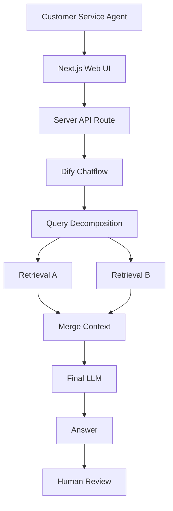

# 企业 AI 客服知识助手

> B2B RAG Customer Service Copilot PoC

一个用于 AI 产品经理作品集展示的 B2B AI 客服工作台 PoC。示例知识来自公开的企业客服政策资料，仅用于个人学习与产品能力展示。

## 项目简介

这不是面向消费者的聊天机器人，而是供企业客服人员使用的 AI Copilot。

AI 基于企业知识库生成有依据的建议回复；客服人员负责采用、编辑或转人工，始终保留最终决策权。

## 业务问题

企业客服的典型处理流程是：

```text
客户提问 → 查询政策 / FAQ → 判断适用规则 → 组织回复 → 特殊情况人工确认
```

这一过程的常见难点包括：

- 查询知识耗时，政策与 FAQ 分散在多个资料中。
- 多条件规则容易被遗漏或误判。
- 直接让 LLM 作答存在脱离企业政策、产生幻觉的风险。

## 产品方案

```text
客户问题 → AI 检索企业知识 → 生成建议回复 → 展示知识依据
         → 客服采用 / 编辑 → 知识不足时转人工
```

工作台以三栏呈现客户会话、客户问题与 AI Copilot 建议，帮助面试官快速理解“客服问题 → RAG → 有依据的建议 → 人工审核”的闭环。AI 辅助人工，不替代人工。

## AI / RAG 架构



- **Query**：客服输入的客户问题。
- **Query Decomposition**：将复合问题拆为可分别检索的子问题。
- **Retrieval**：从企业知识库取回相关片段；知识入库过程包含 Chunk、Embedding、Hybrid Search 与 Rerank。
- **Context**：合并多路检索证据，为最终判断提供上下文。
- **Generation**：最终 LLM 基于证据生成建议回复；知识不足时应拒答并转人工。

RAG、检索、拆解与最终生成均在既有 Dify Chatflow 中完成；Web 仅调用最终 Chatflow，不在前端重建 RAG 系统。

## V1 → V2 → V2.1 迭代

### V1：原始 PDF 直接入库

- Chunk 较大，优点是上下文完整。
- 问题是噪声较高，单一问题的检索不够精准。

### V2：清洗与 FAQ 级 Chunk

- 将 PDF 清洗为 Markdown，并按 FAQ / 语义单元拆分 Chunk。
- 单一意图问题的召回更精准。
- 新问题：如“会员 + 半年 + 家电”这类复合问题，可能只召回其中一条规则。

### V2.1：多路检索与 Query Decomposition

- 曾将 Top K 从 3 提升到 5，但未解决多规则召回问题。
- 改为将复杂问题拆为两个独立 Query，分别 Retrieval，合并 Context 后由最终 LLM 判断。
- 该方式改善了“会员 + 半年 + 家电”“退货期限 + 已使用”等多规则场景。
- Trade-off：延迟增加，LLM 调用成本也增加。

## 测试案例

| 类型 | 示例问题 | 验证目标 |
|---|---|---|
| 简单 FAQ | 会员卡丢了怎么办？ | 单规则检索与直接政策回答 |
| 复合问题 | 我是会员，半年前买了一台家电，可以退吗？ | 多规则检索、证据合并与条件判断 |
| 知识库外问题 | 南京宜家今天几点关门？ | 知识不足拒答与人工确认 |

本项目不虚构准确率、节省成本或效率提升等业务指标。

## 产品功能

- 客户会话切换
- AI 建议回复
- 采用回复与人工编辑
- 重新生成
- 转人工
- 知识不足拒答
- 响应耗时与错误处理
- Demo Mode（本地 Mock 数据）
- Real Mode（真实 Dify Chatflow）

## 技术栈

- Next.js App Router
- React
- TypeScript（strict）
- Tailwind CSS 与项目自定义 CSS
- Dify Chatflow
- RAG
- REST API

## Real Mode / Demo Mode

### Real Mode

`NEXT_PUBLIC_DEMO_MODE=false` 时，浏览器调用同域 Next.js Server API Route，再由服务端调用真实 Dify RAG Chatflow。页面展示真实回答、真实请求耗时与 API 实际返回的引用。

### Demo Mode

`NEXT_PUBLIC_DEMO_MODE=true` 时，页面使用本地预设 Mock 数据，不请求 Dify。界面会明确标识 `Demo Mode / Mock 数据`，不会将 Mock 结果冒充真实 AI 或真实企业指标，适合稳定的作品集演示。

## 安全设计

- `DIFY_API_KEY` 仅由服务端读取。
- 真实密钥仅放在 `.env.local`，且该文件已被 Git 忽略。
- 浏览器不直接访问 Dify；调用链为 Browser → Next.js API Route → Dify。
- 前端不暴露 Secret，也不记录 API Key。

## 已知限制

- 当前 Dify API 返回的 `retriever_resources` 为空，因此网页无法展示真实 Chunk 引用；页面会如实显示“当前 API 未返回可展示的引用信息”。
- 当前没有数据库；刷新页面后，会话、人工确认与编辑状态会重置。
- 这是作品集 PoC，不包含登录、多租户、CRM、工单系统等生产级企业能力。
- Query Decomposition 改善复杂问题效果，但会增加延迟与调用成本。

## 本地运行

### 1. 安装依赖

```bash
npm install
```

### 2. 配置环境变量

在根目录创建 `.env.local`，不要提交该文件。

```dotenv
DIFY_API_URL=
DIFY_API_KEY=
NEXT_PUBLIC_DEMO_MODE=
```

使用 Demo Mode 时设置 `NEXT_PUBLIC_DEMO_MODE=true`；使用真实 Dify 时设置为 `false` 并填写服务端 Dify 配置。

### 3. 启动项目

```bash
npm run dev
```

打开 [http://localhost:3000](http://localhost:3000)。

## 项目定位

本项目重点展示：

- AI 产品问题定义
- RAG 知识库设计
- Chunk 优化
- Retrieval 测试
- Query Decomposition
- AI 拒答与人工审核
- AI 效果、延迟与成本的 Trade-off
- 使用 AI 辅助编程快速构建产品 PoC

它是用于阐释产品思考与 AI 应用设计的作品集项目，不是生产级企业系统。
